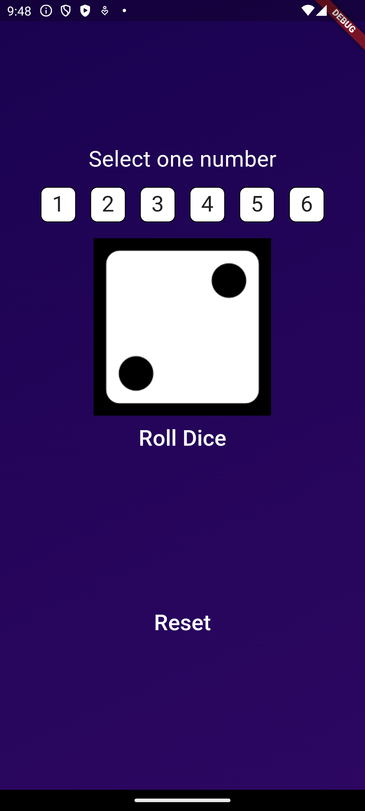

# 🎲 Flutter rolling Dice Game

A simple and fun dice game built with **Flutter**.  
This app demonstrates the basics of Flutter widgets, state management, and hot reload.

---

## 📸 Screenshot
<p align="center">
  
</p>

---

## 🚀 Features
- 🎲 Roll two dice with a single tap
- 🔄 Random number generation
- 🖼️ Simple & interactive UI
- ⚡ Powered by Flutter’s hot reload

---

## 📂 Project Structure
lib/
├── main.dart # Entry point of the app
└── dice_page.dart # UI & logic for dice rolling


---

## 🛠️ Getting Started

### 1️⃣ Prerequisites
- Install [Flutter SDK](https://docs.flutter.dev/get-started/install)
- Install Android Studio / VS Code with Flutter plugin

### 2️⃣ Clone & Run
```bash
git clone https://github.com/Shailendrawilliam/dicegame.git
cd dicegame
flutter pub get
flutter run


💡 How to Play

Tap the dice to roll

Numbers update randomly between 1–6

Just like a real dice game!

🤝 Contributing

Pull requests are welcome. For major changes, please open an issue first to discuss what you’d like to change.

📄 License

Distributed under the MIT License.
See LICENSE for more information.